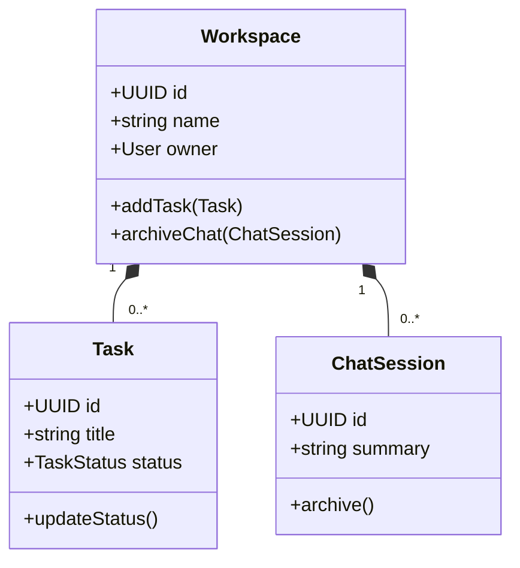
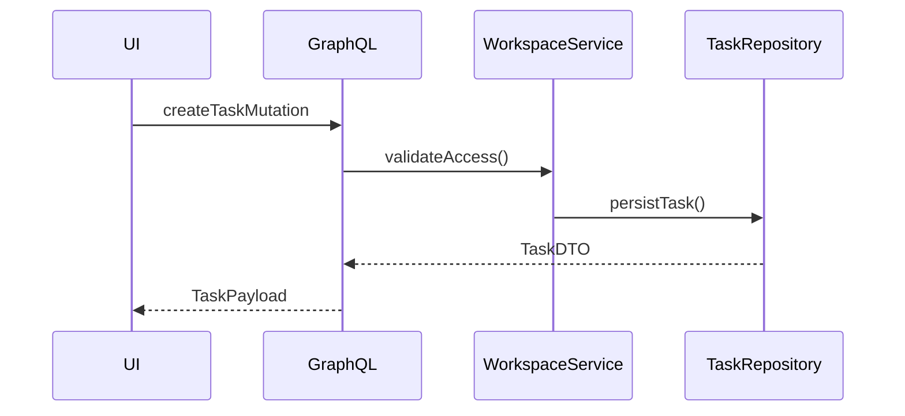

# Workspace Domain Model Architecture

## Core Class Relationships



## Security Architecture

### Access Control Matrix
| Resource       | Owner Access          | Admin Access         | Member Access       |
|----------------|-----------------------|----------------------|---------------------|
| Workspace      | CRUD                  | CRU                  | R                   |
| Task           | CRUD                  | CRUD                 | CRU (assigned only) |
| ChatSession    | Delete/Archive        | Archive              | Read                |

### Encryption Standards
```php
// Aligned with [src/Application/Authentication/Communication/SendMagicLinkEmail.php:0]
class NoteEncryptionService {
    public function encryptNoteContent(string $content): string {
        return sodium_crypto_secretbox(
            $content,
            $nonce = random_bytes(SODIUM_CRYPTO_SECRETBOX_NONCEBYTES),
            $this->encryptionKey
        );
    }
}
```

## Data Persistence Strategy

### Database Schema
```sql
-- Following [resources/db/migrations/20241224000001_create_profiles_table.php:0] pattern
CREATE TABLE workspace (
    id UUID PRIMARY KEY,
    name VARCHAR(255) NOT NULL,
    owner_id UUID REFERENCES users(id) ON DELETE CASCADE
);

CREATE TABLE task (
    id UUID PRIMARY KEY,
    workspace_id UUID REFERENCES workspace(id) ON DELETE CASCADE,
    title VARCHAR(255) NOT NULL,
    status VARCHAR(20) CHECK(status IN ('todo', 'in_progress', 'done'))
);
```

## Integration Points

### Event Flow


## Next Steps Implementation Guide
1. Create migration files following [resources/db/migrations/](resources/db/migrations/:0) patterns
2. Implement repository classes mirroring [src/Infrastructure/Profile/ProfileRepository.php:0]
3. Add GraphQL types to [resources/graphql/workspace.graphql](resources/graphql/workspace.graphql:0)